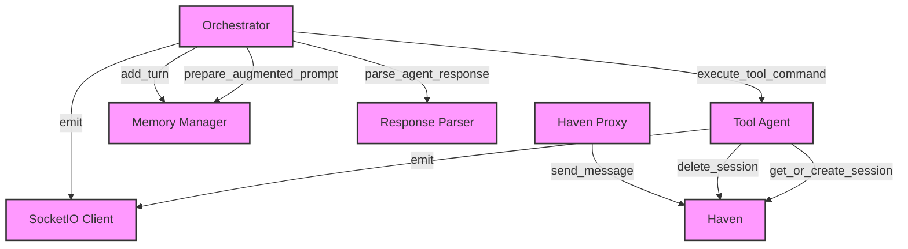

# System Interaction Map

This diagram illustrates the primary interactions and call flows between the major components of the Phoenix Agent system. It is generated automatically from the source code.

