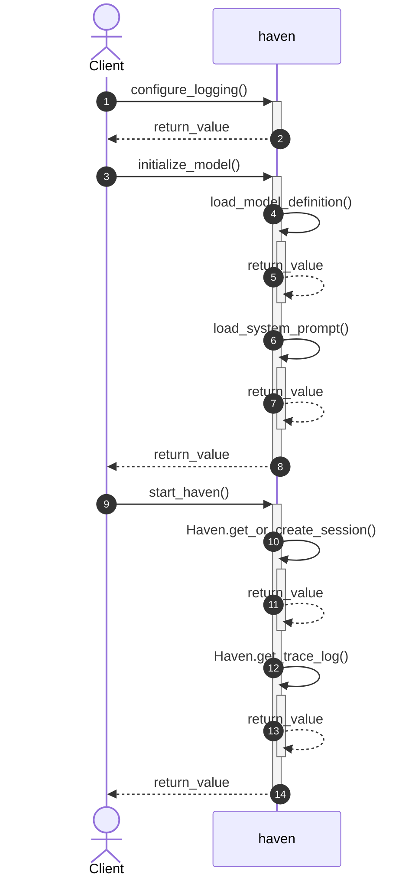

# Sequence Diagram for: 01_startup_and_connect (Haven Service)

**Description**: Traces the initial connection of a client, session creation, and disconnection without any prompts.

```mermaid
sequenceDiagram
    autonumber
    actor Client
    participant haven

    Client->>+haven: configure_logging()
    haven-->>-Client: return_value
    Client->>+haven: initialize_model()
    haven->>+haven: load_model_definition()
    haven-->>-haven: return_value
    haven->>+haven: load_system_prompt()
    haven-->>-haven: return_value
    haven-->>-Client: return_value
    Client->>+haven: start_haven()
    haven->>+haven: Haven.get_or_create_session()
    haven-->>-haven: return_value
    haven->>+haven: Haven.get_trace_log()
    haven-->>-haven: return_value
    haven-->>-Client: return_value
```