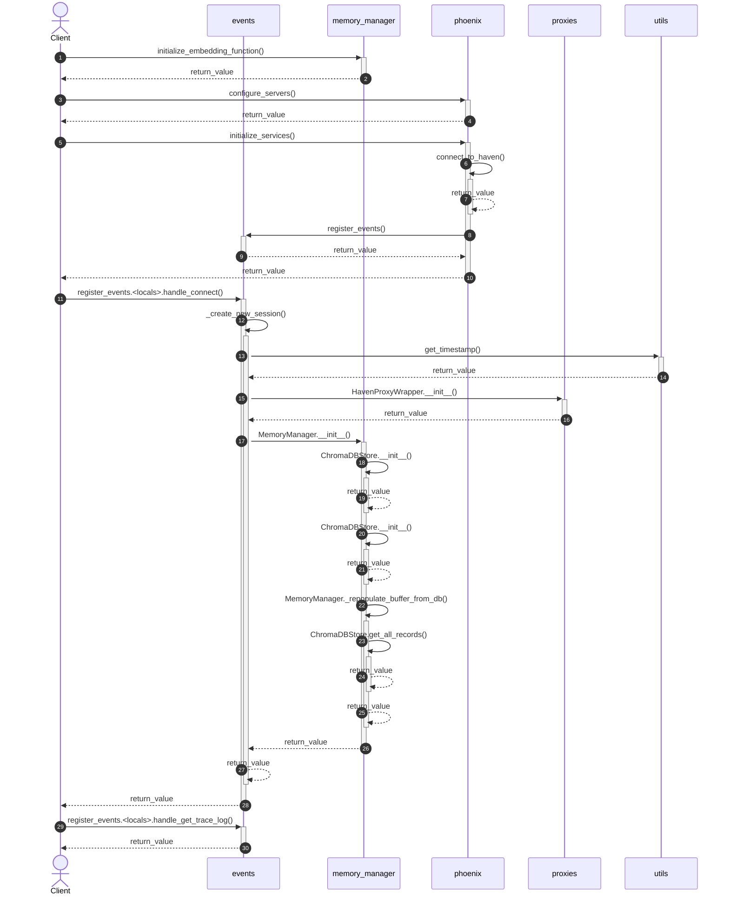

# Sequence Diagram for: 01_startup_and_connect

**Description**: Traces the initial connection of a client, session creation, and disconnection without any prompts.

```mermaid
sequenceDiagram
    autonumber
    actor Client
    participant events
    participant memory_manager
    participant phoenix
    participant proxies
    participant utils

    Client->>+memory_manager: initialize_embedding_function()
    memory_manager-->>-Client: return_value
    Client->>+phoenix: configure_servers()
    phoenix-->>-Client: return_value
    Client->>+phoenix: initialize_services()
    phoenix->>+phoenix: connect_to_haven()
    phoenix-->>-phoenix: return_value
    phoenix->>+events: register_events()
    events-->>-phoenix: return_value
    phoenix-->>-Client: return_value
    Client->>+events: register_events.<locals>.handle_connect()
    events->>+events: _create_new_session()
    events->>+utils: get_timestamp()
    utils-->>-events: return_value
    events->>+proxies: HavenProxyWrapper.__init__()
    proxies-->>-events: return_value
    events->>+memory_manager: MemoryManager.__init__()
    memory_manager->>+memory_manager: ChromaDBStore.__init__()
    memory_manager-->>-memory_manager: return_value
    memory_manager->>+memory_manager: ChromaDBStore.__init__()
    memory_manager-->>-memory_manager: return_value
    memory_manager->>+memory_manager: MemoryManager._repopulate_buffer_from_db()
    memory_manager->>+memory_manager: ChromaDBStore.get_all_records()
    memory_manager-->>-memory_manager: return_value
    memory_manager-->>-memory_manager: return_value
    memory_manager-->>-events: return_value
    events-->>-events: return_value
    events-->>-Client: return_value
    Client->>+events: register_events.<locals>.handle_get_trace_log()
    events-->>-Client: return_value
```