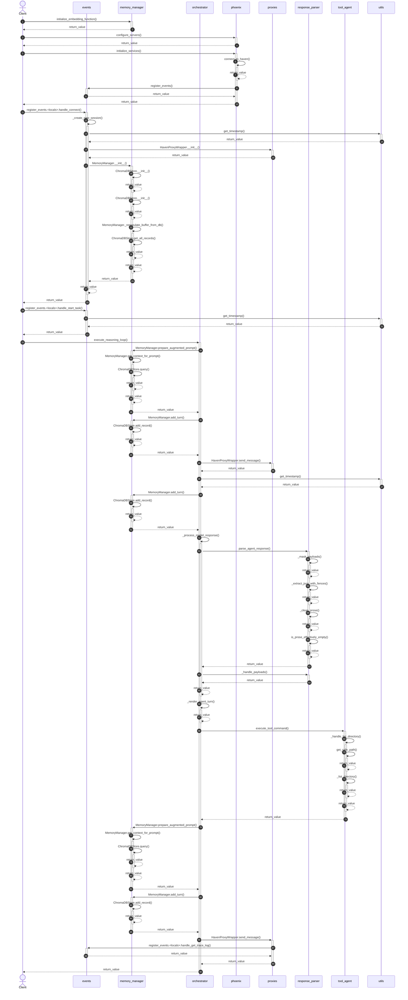

# Sequence Diagram for: 03_complex_prompt_with_tools

**Description**: Traces a complex prompt that requires the agent to use tools (in this case, listing files).

```mermaid
sequenceDiagram
    autonumber
    actor Client
    participant events
    participant memory_manager
    participant orchestrator
    participant phoenix
    participant proxies
    participant response_parser
    participant tool_agent
    participant utils

    Client->>+memory_manager: initialize_embedding_function()
    memory_manager-->>-Client: return_value
    Client->>+phoenix: configure_servers()
    phoenix-->>-Client: return_value
    Client->>+phoenix: initialize_services()
    phoenix->>+phoenix: connect_to_haven()
    phoenix-->>-phoenix: return_value
    phoenix->>+events: register_events()
    events-->>-phoenix: return_value
    phoenix-->>-Client: return_value
    Client->>+events: register_events.<locals>.handle_connect()
    events->>+events: _create_new_session()
    events->>+utils: get_timestamp()
    utils-->>-events: return_value
    events->>+proxies: HavenProxyWrapper.__init__()
    proxies-->>-events: return_value
    events->>+memory_manager: MemoryManager.__init__()
    memory_manager->>+memory_manager: ChromaDBStore.__init__()
    memory_manager-->>-memory_manager: return_value
    memory_manager->>+memory_manager: ChromaDBStore.__init__()
    memory_manager-->>-memory_manager: return_value
    memory_manager->>+memory_manager: MemoryManager._repopulate_buffer_from_db()
    memory_manager->>+memory_manager: ChromaDBStore.get_all_records()
    memory_manager-->>-memory_manager: return_value
    memory_manager-->>-memory_manager: return_value
    memory_manager-->>-events: return_value
    events-->>-events: return_value
    events-->>-Client: return_value
    Client->>+events: register_events.<locals>.handle_start_task()
    events->>+utils: get_timestamp()
    utils-->>-events: return_value
    events-->>-Client: return_value
    Client->>+orchestrator: execute_reasoning_loop()
    orchestrator->>+memory_manager: MemoryManager.prepare_augmented_prompt()
    memory_manager->>+memory_manager: MemoryManager.get_context_for_prompt()
    memory_manager->>+memory_manager: ChromaDBStore.query()
    memory_manager-->>-memory_manager: return_value
    memory_manager-->>-memory_manager: return_value
    memory_manager-->>-orchestrator: return_value
    orchestrator->>+memory_manager: MemoryManager.add_turn()
    memory_manager->>+memory_manager: ChromaDBStore.add_record()
    memory_manager-->>-memory_manager: return_value
    memory_manager-->>-orchestrator: return_value
    orchestrator->>+proxies: HavenProxyWrapper.send_message()
    proxies-->>-orchestrator: return_value
    orchestrator->>+utils: get_timestamp()
    utils-->>-orchestrator: return_value
    orchestrator->>+memory_manager: MemoryManager.add_turn()
    memory_manager->>+memory_manager: ChromaDBStore.add_record()
    memory_manager-->>-memory_manager: return_value
    memory_manager-->>-orchestrator: return_value
    orchestrator->>+orchestrator: _process_model_response()
    orchestrator->>+response_parser: parse_agent_response()
    response_parser->>+response_parser: _mask_payloads()
    response_parser-->>-response_parser: return_value
    response_parser->>+response_parser: _extract_json_with_fences()
    response_parser-->>-response_parser: return_value
    response_parser->>+response_parser: _clean_prose()
    response_parser-->>-response_parser: return_value
    response_parser->>+response_parser: is_prose_effectively_empty()
    response_parser-->>-response_parser: return_value
    response_parser-->>-orchestrator: return_value
    orchestrator->>+response_parser: _handle_payloads()
    response_parser-->>-orchestrator: return_value
    orchestrator-->>-orchestrator: return_value
    orchestrator->>+orchestrator: _render_agent_turn()
    orchestrator-->>-orchestrator: return_value
    orchestrator->>+tool_agent: execute_tool_command()
    tool_agent->>+tool_agent: _handle_list_directory()
    tool_agent->>+tool_agent: get_safe_path()
    tool_agent-->>-tool_agent: return_value
    tool_agent->>+tool_agent: _list_directory()
    tool_agent-->>-tool_agent: return_value
    tool_agent-->>-tool_agent: return_value
    tool_agent-->>-orchestrator: return_value
    orchestrator->>+memory_manager: MemoryManager.prepare_augmented_prompt()
    memory_manager->>+memory_manager: MemoryManager.get_context_for_prompt()
    memory_manager->>+memory_manager: ChromaDBStore.query()
    memory_manager-->>-memory_manager: return_value
    memory_manager-->>-memory_manager: return_value
    memory_manager-->>-orchestrator: return_value
    orchestrator->>+memory_manager: MemoryManager.add_turn()
    memory_manager->>+memory_manager: ChromaDBStore.add_record()
    memory_manager-->>-memory_manager: return_value
    memory_manager-->>-orchestrator: return_value
    orchestrator->>+proxies: HavenProxyWrapper.send_message()
    proxies->>+events: register_events.<locals>.handle_get_trace_log()
    events-->>-proxies: return_value
    proxies-->>-orchestrator: return_value
    orchestrator-->>-Client: return_value
```